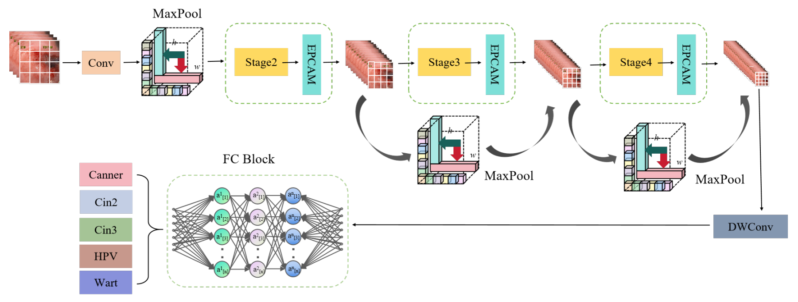
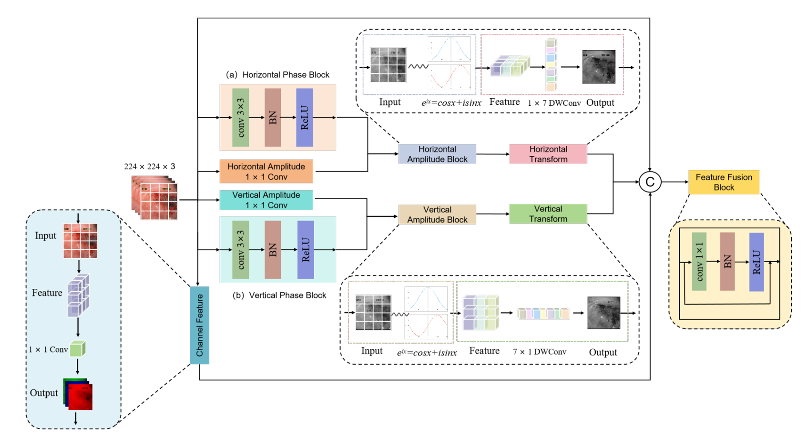

# EPA-ShuffleNet

## 1. Project Brief : What is the EPA-ShuffleNet ?
EPA-ShuffleNet：An Efficient Cervical Screening Network with Euler Phase Attention and Dense connections

Early sereening for cervical cancer is of paramount significance in reducing both its incidence andmortality rates. This paper proposes a lightweight cervical image classification model, EPA-ShufeNet to address the issues of excessive parameter counts and high computational complexity in existing modelswhen deployed on mobile devices. Building upon the ShufleNetV2 architecture, the model incorporatescross-stage dense connections and the SiLU activation function, while introducing an attention modulebased on Euler phase transformation to enhance feature representation capability.



## 2. Environmental Dependency : How to work it ?
- Python ≥ 3.9
- In this work , we use the torch 2.8.0+cu128 and torchvision 0.23.0+cu128(https://pytorch.org/)
- CUDA 12.X (It is recommended to have more than two cards. The script defaults to `CUDA_VISIBLE_DEVICES=0,1`)

```bash
conda create -n EPA_ShuffileNet python=3.11
conda activate EPA_ShuffileNet 
pip install -r requirements.txt
```
If u need to make the data_pre_processing , you still need run:
```bash
pip install pandas,matplotlib,opencv-python
```

## 3. Data Preparation : How to make the dataset ?
1. **Data**：The data that support the findings of this study are openly available in Kaggle at url {https://www.kaggle.com/c/intel-mobileodt-cervical-cancer-screening}.。
2. **Preparation**：
```bash
cd data_pre_processing
python data_pre_processing.py
python convert_to_grayscale.py
python gaussian.py
# ROI
python roi_extraction.py
```

## 4. Run : How to use it ?
```bash
CUDA_VISIBLE_DEVICES=0,1
python main.py \
  --data /path/to/dataset \
  --data_test /path/to/dataset \
  --arch resnet18_dwt \
  --wavename haar \
  -b 256 --epochs 300 \
  --gpu 0,1 --lr 0.1
```


## 5. Key Features : What is the key features ?
-Euler Phase Conversion Attention Mechanism(EPCAM)


## 6. The paper

If the code or method help you in the research, please cite the following paper:

```bash
@inproceedings{li2020wavelet,
  title={Wavelet integrated CNNs for noise-robust image classification},
  author={Li, Qiufu and Shen, Linlin and Guo, Sheng and Lai, Zhihui},
  booktitle={Proceedings of the IEEE/CVF Conference on Computer Vision and Pattern Recognition},
  pages={7245--7254},
  year={2020}
}

@article{qiufu_2021_TIP,
author = {Li, Qiufu and Shen, Linlin and Guo, Sheng and Lai, Zhihui},
title = {WaveCNet: Wavelet Integrated CNNs to Suppress Aliasing Effect for Noise-Robust Image Classification},
booktitle = {IEEE Transactions on Image Processing (TIP)},
month = {july},
year = {2021},
pages = {7074--7089},
vol = {30}
}

@InProceedings{Ma_2018_ECCV,
  author    = {Ma, Ningning and Zhang, Xiangyu and Zheng, Hai-Tao and Sun, Jian},
  title     = {ShuffleNet V2: Practical Guidelines for Efficient CNN Architecture Design},
  booktitle = {Proceedings of the European Conference on Computer Vision (ECCV)},
  month     = {September},
  year      = {2018},
  pages     = {116--131}
}
```

